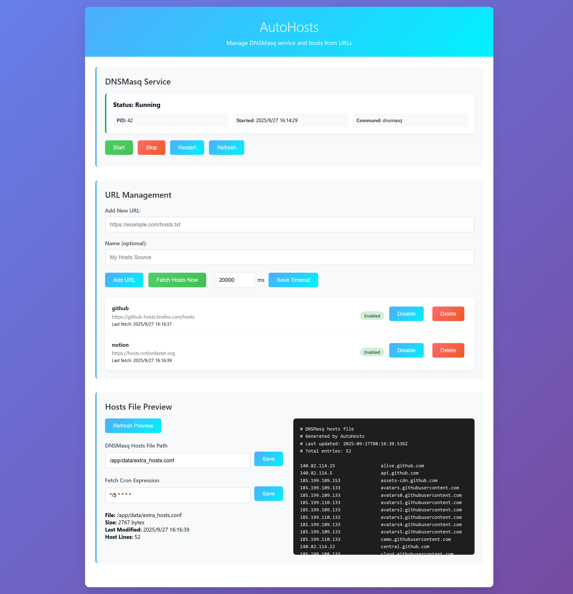

# AutoHosts

[简体中文](README_zh.md)

AutoHosts is a modern, powerful NestJS-based web application for automatic DNS hosts management. It fetches hosts files from multiple sources, manages them with DNSMasq, and provides a beautiful web UI for control and monitoring.



## 🚀 Features

- **DNSMasq Service Management**: Start, stop, restart, and monitor DNSMasq with one click
- **URL-based Hosts Management**: Add, edit, delete, enable/disable hosts sources
- **Automatic Hosts Fetching**: Scheduled or manual fetching with configurable timeout and cron
- **Real-time Preview**: View generated hosts file and stats instantly
- **Modern Web UI**: Responsive, mobile-friendly, light/dark mode
- **Secure & Reliable**: Runs as non-root, input validation, health checks

## 🏁 Quick Start

### Docker (Recommended)

#### Option 1: Docker Hub

```bash
# Pull from Docker Hub
docker pull libzonda/autohosts:latest

# Run with minimal configuration
docker run -d \
  --name autohosts \
  -p 3000:3000 \
  -p 53:53/tcp \
  -p 53:53/udp \
  --privileged \
  libzonda/autohosts:latest
```

#### Option 2: GitHub Packages

```bash
# Pull from GitHub Packages
docker pull ghcr.io/libzonda/autohosts:latest

# Run with minimal configuration
docker run -d \
  --name autohosts \
  -p 3000:3000 \
  -p 53:53/tcp \
  -p 53:53/udp \
  --privileged \
  ghcr.io/libzonda/autohosts:latest
```

#### Option 3: Docker Compose (recommended for customization)

```bash
# Download docker-compose.yml
wget https://raw.githubusercontent.com/libzonda/AutoHosts/main/docker-compose.yml

# Create data and logs directories
mkdir -p data logs

# Start the service
docker compose up -d
```

Access the Web UI: [http://localhost:3000](http://localhost:3000)

Customization:
- Mount volume `/app/data` to persist hosts and config files
- Mount volume `/app/logs` to persist logs
- Configure through environment variables (see Configuration section)

### Manual

- Node.js 20+
- DNSMasq installed

```bash
npm install
npm run build
npm run start:prod
```

## ⚙️ Configuration

- `config.json`: Main app config (cron, hosts file path, fetch timeout)
- `urls.json`: List of hosts sources
- Environment variables:
  - `DNSMASQ_HOSTS` (default: `./extra_hosts.conf`)
  - `PORT` (default: `3000`)

## 🐧 DNSMasq Installation

| OS            | Command                      |
|---------------|-----------------------------|
| Alpine Linux  | `apk add dnsmasq`           |
| Ubuntu/Debian | `apt-get install dnsmasq`   |
| CentOS/RHEL   | `yum install dnsmasq`       |
| macOS         | `brew install dnsmasq`      |

## 🖥️ Web UI Usage

- **Service**: Start/stop/restart DNSMasq
- **URL Management**: Add/enable/disable/delete hosts sources
- **Preview**: View hosts file and stats
- **Manual Fetch**: Fetch all hosts now (with custom timeout)
- **Config**: Edit cron, hosts path, fetch timeout

## 📦 Project Structure

```
src/
├── config/    # Config management
├── dnsmasq/   # DNSMasq service
├── hosts/     # Hosts file logic
├── url/       # URL management
├── public/    # Static web files
```

## 📝 API Endpoints (Partial)

- `GET /api/dnsmasq/status` — Service status
- `POST /api/dnsmasq/start|stop|restart` — Control service
- `GET/POST /api/urls` — Manage sources
- `GET /api/hosts/content|stats` — Hosts file info
- `POST /api/hosts/fetch` — Manual fetch

## 🐳 Docker Tags

- `latest` - Latest stable release from main branch
- `v1.2.3` - Release version (full semver)
- `1.2` - Release version (major.minor)
- `main` - Latest build from main branch
- `pr-123` - Pull request build
- `sha-abc123` - Specific commit

Available on both:
- Docker Hub: `docker pull libzonda/autohosts:latest`
- GitHub Packages: `docker pull ghcr.io/libzonda/autohosts:latest`

## 🛠️ Development

```bash
npm install
npm run start:dev
npm run lint
npm test
```

## 🤝 Contributing

1. Fork & branch
2. Commit & PR
3. Describe your change

## 📝 License

Apache License 2.0. See LICENSE for details.
